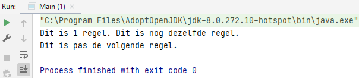

## System.out.print() and System.out.println()

The Difference between System.out.print() and System.out.println() is the following.

    package B_Print;
    
    public class Main {
        public static void main(String[] args) {            
            System.out.print("Dit is ");
            System.out.print("1 regel. ");
            System.out.println("Dit is nog dezelfde regel.");
            
            System.out.println("Dit is pas de volgende regel.");
        }
    }

System.out.print() has no enter, it stays on the same line. System.out.println() does have an enter and goes to the next line.