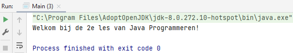

## Another Hello World

This Hello World has a data type `int` that is used in the `System.out.println`.

    package E_AnotherHelloWorld;
    
    public class Main {
        public static void main(String[] args) {
            int currentLesson=2;
            System.out.println("Welkom bij de "+currentLesson+"e les van Java Programmeren!");
        }
    }

