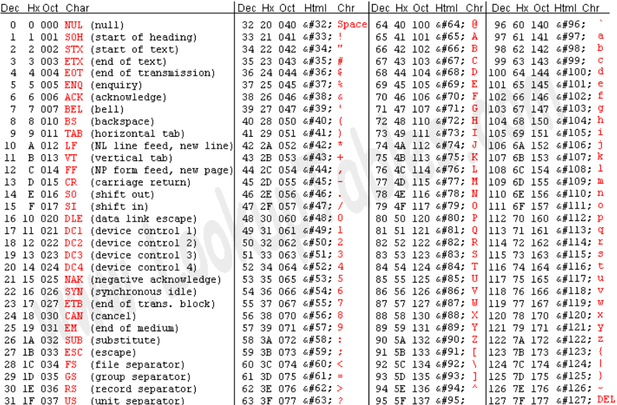

## Char

The `char` data type stores character data in a fixed-length field. Data can be a string of single-byte or multibyte letters, numbers, and other characters that are supported by the code set of the database locale.

    char myChar = 'D';

Unicode is always written with first \ and then a code from https://unicode-table.com/en/.

    char myUnicodeChar = '\u0044';
    System.out.println(myChar); // D
    System.out.println(myUnicodeChar); // D
    char myCopyrightChar = '\u00A9'; 
    System.out.println(myCopyrightChar); // ©

ASCII is always written with first \ and then a code from http://www.asciitable.com/.

    char myAscIIChar = '\106';
    System.out.println(myAscIIChar); // F

## Boolean

The `boolean` keyword is a data type. It is used to store only two possible values, either true or false. It specifies 1-bit of information and its "size" can't be defined precisely. The boolean keyword is used with variables and methods. Its default value is false.

    boolean myTrueBoolean = true;
    boolean myFalseBoolean = false;
    
    boolean isCustomerOverTwentyOne = true;
