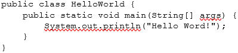

**Hello World**

Java files have the file extension .java and class names start with an uppercase letter.

The Java Virtual Machine (JVM) is responsible for executing the Java byte code. During compilation, your Java code is converted into bits and bytes and the JVM then executes this code.

Suppose we make five other classes, how does the Java Virtual Machine know where to start executing your code? This is solved in Java by adding the main() method in one of the classes. This main method is the input of the application. It looks like this:

In the code above we created a class HelloWorld. This class has 1 method called main. In Java we always write method names in lowercase. You can also see that we indented the code. In Java, after each brace ({}) we let all code start one tab button further on the line.

A Java project can have multiple classes with a main() method. However, only one can be executed at a time.
