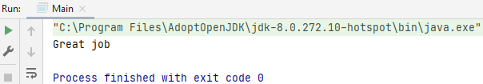
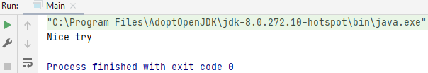
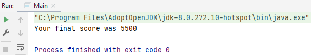
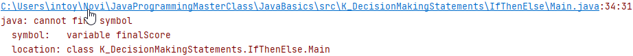

## If then else

### Example #1 - if else

    boolean gameOver = true;
    int score = 5000;
    int levelCompleted = 5;
    int bonus = 100;
    
If the if-statement is not true then print the else-statement

    if (score < 5000) {
        System.out.println("Your score was less than 5000");
    } else {
        System.out.println("Great job"); // Great job
    }

### Example #2 - if-elseif-else statement

    boolean gameOver = true;
    int score = 5000;
    int levelCompleted = 5;
    int bonus = 100;

    if (score < 5000 && score > 1000) {
        System.out.println("Your score was less than 5000 but greater than 1000");
    } else if (score < 1000) {
        System.out.println("Your score was less than 1000");
    } else {
        System.out.println("Nice try"); // Nice try
    }

### Example #3 - accessing {}

Within the {} you can access outside variables...

    if (gameOver == true) {
        int finalScore = score + (levelCompleted * bonus); // 5000 (5 * 100)
        System.out.println("Your final score was " + finalScore); // Your final score was 5500
    }

...however, you cannot call a variable within the {}, it will give an error.

    int savedFinalScore = finalScore;

## Challenge

Print out a second score on the screen with the following:
* score set to 10.000
* levelCompleted set to 8
* bonus set to 200 

But make sure the first printout above still displays as well.