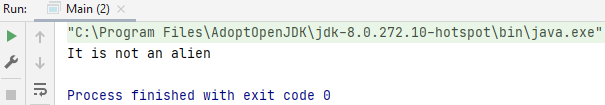
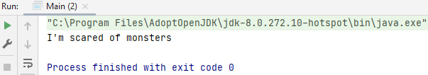
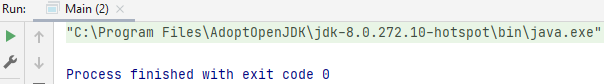

## If then

The if-then statement is the most basic of all the control flow statements. It tells your program to execute a certain section of code only if a particular test evaluates to true.

    boolean isAlien = false;
    if (isAlien == false)
    System.out.println("It is not an alien"); // It is not an alien

`=` is an assignment operator. 
`== `asks if the operands (`isAlien`) are identical or equal to each other.

Important: if statement doesn't have `;` behind `if (isAlien == false)`, but i doesn't give an error message if you do.

    

    boolean isMonster = false;
    if (isMonster == true)
        System.out.println("It is not a monster"); // doesn't print this out
        System.out.println("I'm scared of monsters"); // print this, even though == is true (it shouldn't print anything)

With a codeblock `{}` he looks at both lines, now he looks only at the first one and prints the second.

 

    boolean isGhost = false;
    if (isGhost == true) {
        System.out.println("It is not a ghost");
        System.out.println("I'm scared of ghosts");
    }

If you use codeblock `{}` he won't print out both lines.

