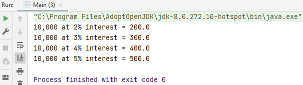
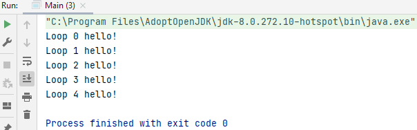

## For Statement

Loops can execute a block of code as long as a certain condition is met. 
Loops are useful because they save time, reduce errors and make the code easier to read.  
When you know exactly how many times you want to loop through a block of code, use the for loop instead of a while loop.

        package R_LoopStatements.ForStatement;
        
        public class Main {
        
            public static void main(String[] args) {
                System.out.println("10,000 at 2% interest = " + calculateInterest(10000.0, 2.0));
                System.out.println("10,000 at 3% interest = " + calculateInterest(10000.0, 3.0));
                System.out.println("10,000 at 4% interest = " + calculateInterest(10000.0, 4.0));
                System.out.println("10,000 at 5% interest = " + calculateInterest(10000.0, 5.0));
            }
        
            public static double calculateInterest(double amount, double interestRate) {
                return (amount * (interestRate / 100));
            }
        }

In the example above you have to make too much code, we do the same but with a loop for (init; termination; increment). 
- init means the code that is going to be initialized once at the start of the loop
- termination is we tell the for loop how we want to exit, at what point do we exit
- increment that's an expression that's invoke after each iteration of the loops each time the loop goes round
  

        package R_LoopStatements.ForStatement;
        
        public class Main {
        
            public static void main(String[] args) {
                for(int i=0; i<5; i++) {
                    System.out.println("Loop " + i + " hello!");
                }
            }
        
            public static double calculateInterest(double amount, double interestRate) {
                return (amount * (interestRate / 100));
            }
        }

## Challenges

### Challenge 1

Using the for statement, call the `calculateInterest` method with the amount of 10000 with an `interestRate` of 2,3,4,5,6,7, and 8.  
Print the results to the console window.

### Challenge 2

How would you modify the for loop above to do the same thing as shown but to start from 8% and work back to 2%.

### Challenge 3

Create a for statement using any range of numbers. 
Determine if the number is a prime number using the `isPrime` method if it is a prime number, print it out. 
AND increment a count of the number of prime numbers found if that count is 3 exit the for loop. 

<i>Hint: Use the break statement to exit</i>

Code given by the teacher:

    public static double calculateInterest(double amount, double interest) {
        return (amount * (interest / 100));
    }

and

    public static boolean isPrime(int n) {
        if (n == 1) {
        return false;
        }

        for (int i = 2; i <= n / 2; i++) {
            System.out.println("Looping " + i);
            if (n % i == 0) {
                return false;
            }
        }
        return true;
    }